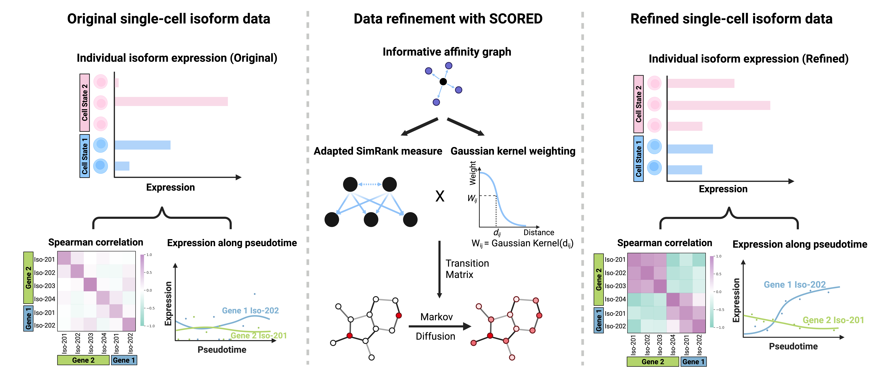

# SCORED 

 [](https://pepy.tech/project/scored)

Long-read single-cell sequencing provides a foundational tool opportunity to resolve full-length isoform expression, but the resulting data is often characterized by profound sparsity and high levels of technical noise (dropouts). This sparsity obscures important biological signals, such as correlations between isoforms and dynamic expression trends along cellular trajectories.

`SCORED` (Single-Cell isOform data REfinement via graph-based Diffusion) is a computational method tailored for the refinement of sparse single-cell RNA isoform expression data generated from long-read sequencing technologies. It addresses the data sparsity challenge by implementing a graph-based diffusion algorithm that borrows information from functionally similar cells to infer a more complete and accurate isoform expression profile for each cell. 



This repository contains the Python implementation, example usage, and experiment results of the `SCORED` algorithm.

## Installation

```bash
pip install SCORED
```

## Running SCORED

### Quick start

The `SCORED` function can be applied directly to raw AnnData objects, with no prior normalization or preprocessing required.

```python
import scanpy as sc
import torch
from scored import SCORED

# Load your AnnData object
adata_transcript = sc.read_h5ad("isoform_level_data.h5ad")
adata_gene = sc.read_h5ad("gene_level_data.h5ad") # Gene-level UMI matrix that accompanies isoform-level data 
# (e.g., from preprocessing pipelines such as wf-single-cell).
# By default, gene-level data is used to infer cell similarity.

# Run SCORED
refined_matrix = SCORED(
    adata_tr = adata_transcript,
    adata_g = adata_gene
)

# To replace the original data with the refined data
adata_transcript_refined = adata_transcript.copy()
adata_transcript_refined.X = refined_matrix
# No further normalization or scaling is needed
```

### Advanced tutorial

#### 1. Isoform-level cell similarity (optional)

`SCORED` can also use isoform-level expression to infer cell similarity (recommended only when sequencing depth is high and isoform-level data is of good quality):

```python
refined_matrix = SCORED(
    adata_tr = adata_transcript
)
```
#### 2. Condition-specific refinement

If the AnnData object contains multiple conditions and you want to preserve subtle, condition-specific expression signatures, you can refine within each condition:

```python
refined_matrix = SCORED(
    adata_tr = adata_transcript,
    adata_g = adata_gene,
    condition_key="condition"
)
```
#### 3. Tuning parameters

The key hyperparameter for `SCORED` is the restart probability parameter `rwr_alpha`. Default is `rwr_alpha = 0.3`,  which is robust in most cases. 
* Smaller values: cells borrow more information from neighbors.
* Larger values: more local information is preserved.

```python
refined_matrix = SCORED(
    adata_tr = adata_transcript,
    adata_g = adata_gene,
    rwr_alpha = 0.3
) 
```

#### 4. GPU acceleration

`SCORED` can leverage GPU for faster runtime. If a GPU is available, set `device="cuda"`:

```python
refined_matrix = SCORED(
    adata_tr = adata_transcript,
    adata_g  = adata_gene,
    device   = "cuda"
)
```


